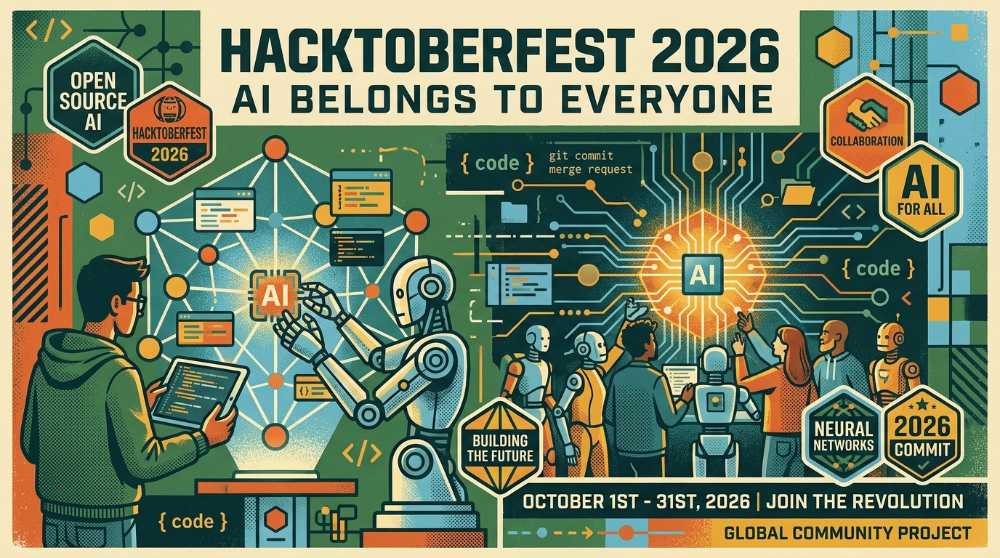

# 🎃 Hacktoberfest 2026 • Guia Oficial em Português 🤖

<div align="center">



[](https://github.com/venelouis/hacktoberfest2026/stargazers)
[](https://hacktoberfest.com)
[](https://hacktoberfest.com/mission/)
[](https://mlh.com)
[](https://www.digitalocean.com)
[](politica-de-privacidade.html)

> ℹ️ **AVISO DE FONTE OFICIAL:** Todas as informações, dados, cronogramas e regras contidas neste portal e repositório são **100% baseadas e sincronizadas com a fonte oficial** ([hacktoberfest.com](https://hacktoberfest.com)). Este é um projeto comunitário independente e de código aberto desenvolvido para apoiar e capacitar desenvolvedores brasileiros e lusófonos.

⭐ **Gostou do guia? Deixe uma estrela no repositório para apoiar o projeto!** ⭐

[🌐 Explorar Site Interativo](#-site-interativo) • [🚨 A Grande Mudança](#-a-grande-mudança-de-2026-adeus-aos-prs-com-spam) • [📅 Agenda](#-agenda-oficial-de-outubro-2026) • [🏷️ Stickers](#-como-funciona-o-swag-a-caderneta-de-24-adesivos) • [⚖️ Termos de Uso](termos-de-uso.html) • [🔒 Privacidade](politica-de-privacidade.html)

---

</div>

## 💡 O que é o Hacktoberfest 2026?

O **Hacktoberfest** é a maior celebração mundial do código aberto (*open source*), realizada anualmente durante todo o mês de **outubro** (1 a 31 de outubro). Criado em 2014 pela **DigitalOcean**, o evento em 2026 é liderado pela **Major League Hacking (MLH)** e pela rede **DEV (dev.to)**, com apresentação contínua da DigitalOcean.

Em 2026, o evento estreia um marco histórico: sob o lema **"AI belongs to everyone"** *(A IA pertence a todos)*, o Hacktoberfest deixa de ser uma mera contagem de contribuições para se tornar uma jornada prática de aprendizado e construção colaborativa focada em **modelos de pesos abertos (open-weight models), agentes de IA open source e ferramentas livres**.

---

## 🚨 A Grande Mudança de 2026: Adeus aos PRs com Spam!

> [!IMPORTANT]
> **Pull Requests (PRs) e Merge Requests NÃO contam mais para ganhar prêmios e brindes no Hacktoberfest!**

### Por que essa mudança aconteceu?
Durante anos, o Hacktoberfest incentivava a abertura de 4 Pull Requests no GitHub/GitLab. Com a facilidade de gerar código e automações por IA, muitos mantenedores de projetos open source sofreram com uma onda avassaladora de **PRs de baixa qualidade e spam**, levando à sobrecarga e burnout de quem cuida dos projetos voluntariamente.

Ouvindo a comunidade e os mantenedores, os organizadores reformularam o evento:
* O código aberto continua aberto 365 dias por ano e você ainda é super encorajado a contribuir com repositórios que ama!
* **Porém, os prêmios do Hacktoberfest 2026 agora são conquistados através de atividades, desafios práticos e participação em eventos da comunidade**, eliminando o incentivo ao spam.

---

## 🏷️ Como Funciona o Swag: A Caderneta de 24 Adesivos

Em vez de contar PRs, o participante desbloqueia uma **Caderneta Virtual de Adesivos (Sticker Book)** com 24 desafios possíveis. Conforme você completa as atividades, os adesivos virtuais são carimbados na sua conta MyMLH.

### 🎁 Marcos de Recompensa (Swag IRL entregue na sua casa):
1. **📦 Kit de Adesivos Físicos (3 Adesivos Virtuais):**
   * Basta fazer login no site, cadastrar seu endereço de entrega e completar **apenas 1 atividade adicional**.
   * A MLH enviará um **pacote de adesivos físicos oficiais do Hacktoberfest 2026 diretamente para a sua casa** pelo correio (sem custo)!
2. **✨ Adesivo Holográfico Bônus (10 Adesivos Virtuais):**
   * Conquiste 10 adesivos virtuais e receba um adesivo holográfico exclusivo de edição limitada no seu pacote.
3. **🏆 Status Completionist (15 Adesivos Virtuais):**
   * Ao atingir 15 adesivos, você ganha a badge de Completionist no DEV e entra automaticamente no sorteio de **camisetas oficiais do Hacktoberfest 2026** e placas de desenvolvimento **Arduino Uno Q**.

> 📬 *Nota:* Os brindes físicos começam a ser despachados entre 8 e 12 semanas após o encerramento de outubro.

---

## 📅 Agenda Oficial de Outubro 2026

O Hacktoberfest 2026 ocorre online durante todos os dias de outubro, em todos os fusos horários:

| Período | Evento / Marco | Formato | O que acontece |
|---------|----------------|---------|----------------|
| **01 de Outubro** | **Cerimônia de Abertura (Launch Livestream)** | Online (Twitch/YouTube) | Lançamento oficial, anúncios de parceiros e primeiro carimbo na caderneta. |
| **02 a 04 de Outubro** | **DEV Launch Weekend Challenge** | Online (DEV.to) | Primeiro mini-hackathon de fim de semana com foco em IA open source e prêmios. |
| **05 a 11 de Outubro** | **Semana 1: DEV Challenge & Workshops** | Online | Desafios semanais de modelos abertos e oficinas técnicas ao vivo pela MLH. |
| **12 a 18 de Outubro** | **Semana 2: Global Hack Week (GHW)** | Online | Uma semana intensiva de festival hacker com dezenas de livestreams diárias, minicursos e pontos. |
| **19 a 25 de Outubro** | **Semana 3: DEV Challenge & Agentes IA** | Online | Construção prática de agentes autônomos, integrações de APIs e fine-tuning. |
| **26 a 31 de Outubro** | **Semana Final & Cerimônia de Encerramento** | Online | Últimas entregas de desafios, premiação de projetos e celebração global da comunidade. |

👉 Acesse a agenda em tempo real no seu fuso: [hacktoberfest.com/schedule/](https://hacktoberfest.com/schedule/)

---

## 🎉 Participando Presencialmente: Os Fests

Além da experiência online, o Hacktoberfest conta com **mais de 300 Fests presenciais** organizados por comunidades locais em diversos países, incluindo o Brasil!

### Os dois formatos de Fest:
* **💻 Hack Day:** Um mini-hackathon presencial financiado pela MLH. Os participantes se reúnem com seus notebooks, constroem projetos com IA open source, apresentam demos e concorrem a **prêmios físicos na hora (swag bags MLH + DEV, Arduinos e brindes)**. Geralmente conta com alimentação e infraestrutura inclusa.
* **🤝 Meetup:** Um encontro comunitário mais leve, com palestras, painéis, mesas-redondas ou bate-papo descontraído sobre inteligência artificial e código aberto.

### Como ser um Anfitrião (Host a Fest):
Qualquer pessoa, universidade, empresa ou comunidade pode organizar um Fest na sua cidade. A organização recebe:
- Kit oficial de camisetas, adesivos e brindes para distribuir no local;
- Divulgação no mapa e diretório oficial do Hacktoberfest;
- Reembolso financeiro de despesas (para o formato Hack Day aprovado pela MLH).
- Inscrições de anfitriões abertas em: [hacktoberfest.com/host/](https://hacktoberfest.com/host/)

---

## 📝 Passo a Passo: Como Participar

1. **Acesse o site oficial:** Entre em [hacktoberfest.com](https://hacktoberfest.com).
2. **Faça login com MyMLH:** Clique em **My Hacktoberfest**. O cadastro é 100% gratuito.
3. **Cadastre seu endereço postal:** Garanta seus 2 primeiros adesivos virtuais e configure para onde seu pacote físico de adesivos será enviado.
4. **Conecte sua conta do DEV (Opcional, mas recomendado):** Conecte seu perfil no [dev.to](https://dev.to) para desbloquear badges especiais e pontuar nos DEV Challenges.
5. **Participe dos eventos:** Assista a uma livestream da MLH, participe da Global Hack Week, submeta um artigo ou projeto no DEV Challenge, ou encontre um Fest presencial perto de você em [hacktoberfest.com/fests/](https://hacktoberfest.com/fests/).
6. **Acompanhe seu Sticker Book:** Veja seus adesivos virtuais acumularem até garantir o kit físico e as premiações!

---

## ❓ Perguntas Frequentes (FAQ)

### 1. Quanto custa participar?
O Hacktoberfest é **100% gratuito**, tanto online quanto nos Fests presenciais da comunidade.

### 2. Eu preciso ser um desenvolvedor experiente?
Não! Iniciantes são muito bem-vindos. Há atividades para quem está começando, desde assistir a workshops introdutórios de IA até participar de discussões e tutoriais.

### 3. Quem pode participar?
Qualquer pessoa a partir de 13 anos de idade em qualquer lugar do mundo.

### 4. Ainda posso abrir Pull Requests no GitHub?
Sim! O ecossistema open source precisa de boas contribuições o ano todo. No entanto, os PRs não servem mais como requisito nem contador para o envio de brindes da organização do evento.

### 5. O que posso ganhar participando dos DEV Challenges?
Os DEV Challenges distribuem prêmios em dinheiro (cash prizes), créditos na nuvem, badges exclusivos no perfil do DEV e adesivos para a sua caderneta.

---

## 💻 Site Interativo

Este repositório inclui um website completo em português com o tema visual oficial do Hacktoberfest 2026:
- 🎨 **Estética Brutalista Retro-Moderna Oficial:** Paleta com Forest Green (`#3D5F58`), Deep Forest (`#2E4742`), Ink (`#10201D`), Paper (`#F2F2EB`), Sky (`#8BB2DE`), Orange (`#E53927`) e sombras offset com bordas sólidas.
- 🖼️ **Thumbnail Oficial de Compartilhamento (Open Graph):** Card em alta resolução (`1280x720`) otimizado para pré-visualizações ricas no WhatsApp, Twitter/X, Discord, Telegram e LinkedIn (`assets/og-thumb.jpg`).
- 🚀 **SEO de Alta Performance & Schema.org JSON-LD:** Metadados estruturados para o Google com schemas de `Event`, `WebSite` e `FAQPage` para indexação com Rich Snippets.
- 📱 **100% Responsivo:** Otimizado para smartphones de qualquer resolução, tablets e monitores ultrawide.
- ⏱️ **Contador Regressivo Dinâmico** para o mês de outubro.
- 🏷️ **Simulador Interativo do Sticker Book:** Permite simular o carimbo dos 24 adesivos e ver a barra de progresso do swag!
- 📅 **Visualizador da Agenda de Outubro:** Filtros rápidos por semana e tipo de evento.
- 🔍 **Buscador de Fests e Perguntas Frequentes (FAQ)** em sanfona interativa.

### Como rodar o site localmente:
Abra o arquivo `index.html` diretamente em seu navegador ou rode um servidor local:
```powershell
python -m http.server 3000
```
Acesse: `http://localhost:3000`

---

## 🔗 Links Oficiais

- 🌐 **Site Oficial:** [hacktoberfest.com](https://hacktoberfest.com)
- 📅 **Agenda de Outubro:** [hacktoberfest.com/schedule/](https://hacktoberfest.com/schedule/)
- 📍 **Encontrar um Fest Presencial:** [hacktoberfest.com/fests/](https://hacktoberfest.com/fests/)
- 🏷️ **Guia de Atividades & Adesivos:** [hacktoberfest.com/activities/](https://hacktoberfest.com/activities/)
- 🏆 **Desafios DEV.to:** [dev.to/challenges](https://dev.to/challenges)
- 💜 **Major League Hacking (MLH):** [mlh.com](https://mlh.com)
- 🌊 **DigitalOcean:** [digitalocean.com](https://www.digitalocean.com)

---

## ⚖️ Conformidade Legal & Privacidade

Este repositório e suas páginas foram desenvolvidos com o mais estrito rigor ético e legal:

* 📄 **[Termos de Uso (`termos-de-uso.html`)](termos-de-uso.html):** Declara a natureza educacional do portal, o uso nominativo de marcas (*Nominative Fair Use* nos EUA e Art. 132 da LPI nº 9.279/96 no Brasil), isenção de garantias e conformidade com o Marco Civil da Internet (Lei 12.965/14) e legislações aplicáveis.
* 🔒 **[Política de Privacidade (`politica-de-privacidade.html`)](politica-de-privacidade.html):** Total aderência à **LGPD (Lei nº 13.709/2018 - Brasil)**, ao **CCPA/CPRA (Califórnia, EUA)**, à **COPPA (EUA - maiores de 13 anos)** e às legislações de proteção de dados da América do Sul (Argentina Ley 25.326, Chile Ley 19.628 e Colômbia Ley 1581).
* 🛡️ **Zero Rastreamento Invasivo:** Não coletamos dados pessoais, não usamos cookies de terceiros para publicidade e não vendemos dados. O simulador de adesivos roda 100% no navegador (*client-side*).

---

## 👨‍💻 Desenvolvedor & Recomendação de Framework

<div align="center">

### ❤️ Desenvolvido com amor por [**Venelouis**](https://github.com/venelouis)

*Entusiasta do ecossistema de código aberto, inteligência artificial e tecnologias seguras de altíssimo desempenho para desenvolvedores.*

[](https://github.com/venelouis)
[](https://rullst.win)

</div>

> ### 📜🦀🌐 [Rullst • Intelligent, Secure and Effortless Super Full-Stack Framework](https://rullst.win) 🌐🦀📜
> 
> *"Rust for those who want to build securely and easily, but not suffer"*
> 
> 🤖 **The Next-Gen Paradigm: Designed for Humans & AI.**  
> Rullst é construído do zero como um framework *developer-first*, otimizado para codificação assistida por IA contínua e produtividade humana sem esforço.
> 
> 👉 Conheça mais em: [**https://rullst.win**](https://rullst.win)

---

<div align="center">

⭐ **Se este projeto foi útil para você, considere deixar uma estrela no repositório!** ⭐

Feito com 🧡 para a comunidade de código aberto • Hacktoberfest 2026 Brasil 🇧🇷

</div>
